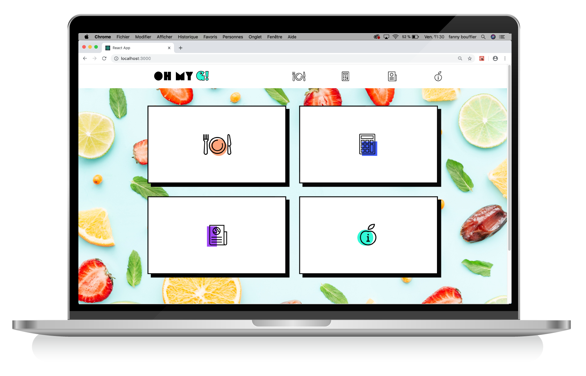
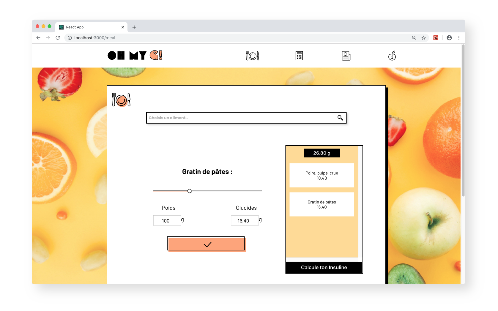
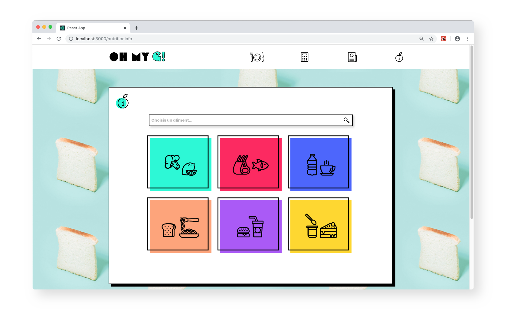

# Oh my G! Project

A web app which helps teenagers to deal with their diabete everyday. Features : a tool to calculate insuline, a tool to calculate glucidic meal income and a nutritional informations database.

#### Homepage


#### Meal Calculation


#### Nutritional Informations Database



#### Installation

```bash
git clone https://github.com/cendrine-b/la-loupe-0217-wiigle.git
cd la-loupe-0217-wiigle
npm install
```

#### Development

```bash
npm start
```

#### Production

```bash
npm run production
```

[](http://forthebadge.com)

